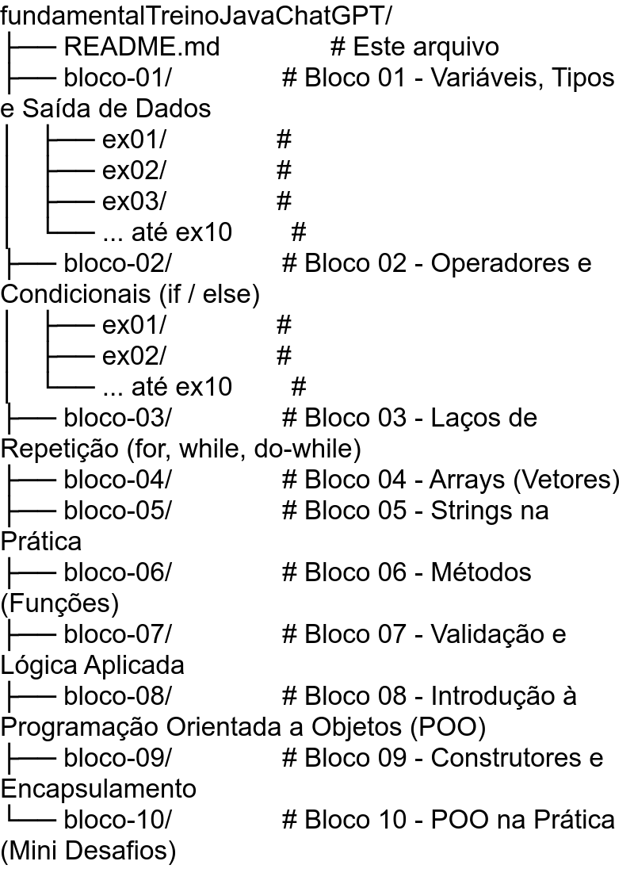

# Java Fundamental: Repositório de Treino

Este repositório contém exercícios de Java nível fundamental, organizados em uma estrutura modular onde cada **bloco** foca em um tópico específico com **10 exercícios progressivos** para enraizar o aprendizado.

## 🚀 Primeiros Passos

1. **Clone o repositório:** `git clone <URL>`
2. **Escolha um bloco:** `git checkout bloco-01`
3. **Comece pelo exercício 01** e siga em ordem
4. **Pratique todos os 10 exercícios** do bloco antes de seguir para o próximo

## 🏗️ Estrutura do Projeto

{: width="350" height="650"}

[//]: # (fundamentalTreinoJavaChatGPT/)

[//]: # (├── README.md               # Este arquivo)

[//]: # (├── bloco-01/               # Bloco 01 - Variáveis, Tipos e Saída de Dados)

[//]: # (│   ├── ex01/               #)

[//]: # (│   ├── ex02/               #)

[//]: # (│   ├── ex03/               #)

[//]: # (│   └── ... até ex10        #)

[//]: # (├── bloco-02/               # Bloco 02 - Operadores e Condicionais &#40;if / else&#41;)

[//]: # (│   ├── ex01/               #)

[//]: # (│   ├── ex02/               #)

[//]: # (│   └── ... até ex10        #)

[//]: # (├── bloco-03/               # Bloco 03 - Laços de Repetição &#40;for, while, do-while&#41;)

[//]: # (├── bloco-04/               # Bloco 04 - Arrays &#40;Vetores&#41;)

[//]: # (├── bloco-05/               # Bloco 05 - Strings na Prática)

[//]: # (├── bloco-06/               # Bloco 06 - Métodos &#40;Funções&#41;)

[//]: # (├── bloco-07/               # Bloco 07 - Validação e Lógica Aplicada)

[//]: # (├── bloco-08/               # Bloco 08 - Introdução à Programação Orientada a Objetos &#40;POO&#41;)

[//]: # (├── bloco-09/               # Bloco 09 - Construtores e Encapsulamento)

[//]: # (└── bloco-10/               # Bloco 10 - POO na Prática &#40;Mini Desafios&#41;)

## 🌿 Estratégia de Branches

- **`main`** → Branch principal contendo apenas a pasta raiz e este README
- **`bloco-01`** → Branch dedicada ao diretório `bloco-01/` (Variáveis, Tipos e Saída de Dados)
- **`bloco-02`** → Branch dedicada ao diretório `bloco-02/` (Operadores e Condicionais (if / else))
- **`bloco-03`** → Branch dedicada ao diretório `bloco-03/` (Laços de Repetição (for, while, do-while))
- ... e assim sucessivamente para cada bloco (até `bloco-10`)

**Importante:** Cada bloco contém 10 exercícios dentro da mesma branch, todos focados no mesmo tema.

## 🚀 Como Acessar os Exercícios

Cada bloco está isolado em sua própria branch. Para acessar um bloco específico:

```bash
# Listar todas as branches disponíveis
git branch -a

# Acessar um bloco específico (ex: bloco-01)
git checkout bloco-01

# Dentro da branch, navegue pelos exercícios:
cd bloco-01/ex01  # Exercício 1 do bloco 1
cd bloco-01/ex02  # Exercício 2 do bloco 1
# etc...

# Voltar para a branch main
git checkout main